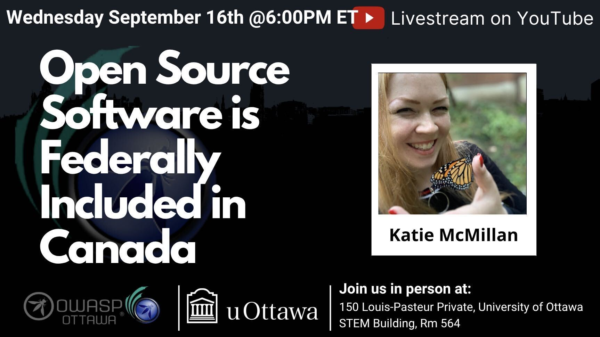
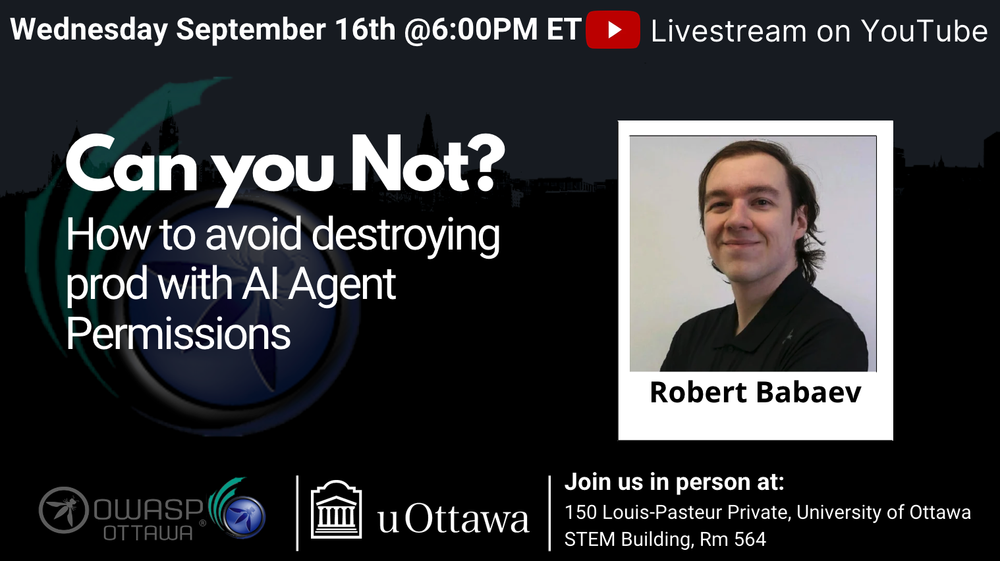

## Next Meeting/Event(s)

## Wednesday September 16th, 2026
### Details

Welcome to our in-Person Meetup at the University of Ottawa

In-Person Location:
***150 Louis-Pasteur Private, Ottawa,
University of Ottawa
Room 564***

We will continue to Live Stream on our YouTube channel. (https://www.youtube.com/@OWASP_Ottawa). Subscribe to our YouTube channel, set a reminder and you’ll get a notification as soon as we go live!

YouTube Live Stream Link: TBA

***6:00 PM EST*** Arrival, setup, mingle, PIZZA!!!

***6:30 PM EST*** Technical Talks
* Introduction to OWASP Ottawa, Public Announcements.
* ***Open Source Software is Federally Included in Canada*** with Katie McMillan
* ***Can You Not? How to Get Your Agents to Actually Behave*** with Robert Babaev

### Abstracts:

***Open Source Software is Federally Included in Canada with Katie McMillan***
This talk aims to summarize how the Government of Canada includes open source software in terms of including it in key policies, directives, and tools, as well including key groups, departments, and people. It also seeks to include important historical considerations.

***Can you Not? How to Avoid Destroying Prod with Agent Permissions with Robert Babaev***
LLMs are very tenacious in that they will do almost anything to achieve their goals! . . . including nuking production. Together we'll work through why agents do this, how permissions work on a handful of different harnesses like Claude Code, Cursor, and OpenCode, and how you can hopefully avoid your next agent crashing production. Again.

### Speaker:
***Katie McMillan*** is the leader and founder of Open Source Connect, a Canadian nonprofit dedicated to open source software (Outreach, Advocacy, and Training). She has been contributing (in various ways) to open source software for about ten years, including being on the Board of Directors for several organizations. She strongly believes in education and collaboration. Similar to other Canadian nonprofits, such as the Canadian Institute for Health Information (CIHI), Open Source Connect functions as an independent organization, but attempts to align with Government of Canada priorities and policies. Her other interests include charity work, volunteering, yoga, horseback riding, and gardening.

***Robert Babaev*** is a DevOps Software Developer working at Acre Security. His experience spans software development, penetration testing, SOC operations, and even GRC. Ever since his first flag in a CTF back in 2019, Robert has wanted to lock down a better future.
