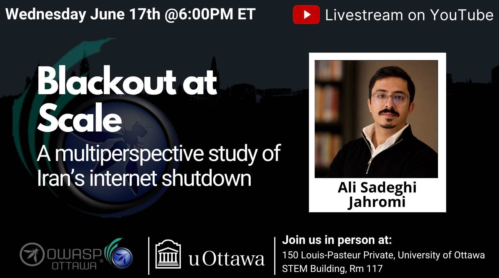

## Next Meeting/Event(s)

## Wednesday June 17th, 2026
### Details

Welcome to our in-Person Meetup at the University of Ottawa

In-Person Location:
***150 Louis-Pasteur Private, Ottawa,
University of Ottawa
Room 117***

We will continue to Live Stream on our YouTube channel. (https://www.youtube.com/@OWASP_Ottawa). Subscribe to our YouTube channel, set a reminder and you’ll get a notification as soon as we go live!

YouTube Live Stream Link: https://www.youtube.com/watch?v=0LnNxjSNLl8

***6:00 PM EST*** Arrival, setup, mingle, PIZZA!!!

***6:30 PM EST*** Technical Talks
* Introduction to OWASP Ottawa, Public Announcements.
* ***"Blackout at Scale: A Multi-Perspective Study of Iran's Internet Shutdown" with Ali Sadeghi Jahromi***

### Abstracts:

***Blackout at Scale: A Multi-Perspective Study of Iran's Internet Shutdown with Ali Sadeghi Jahromi***
This talk presents the Internet shutdowns in Iran during January and March 2026 using a multi-plane measurement approach that combines passive Internet-wide scanning, active probing, and BGP routing analysis. We show how these disruptions were enforced through centralized forwarding-plane null-routing while BGP announcements remained largely unchanged, effectively hiding outages from traditional routing-based monitoring. Using global scan data, we analyze how visible host populations collapse and fluctuate during shutdown periods, including apparent anomalies that reflect measurement artifacts rather than true recovery. Through active probing of thousands of Iranian prefixes from multiple global vantage points, we find that most infrastructure becomes consistently unreachable in a centrally coordinated manner, with only a small subset of networks remaining accessible. We further identify systematic structural exemptions, including academic networks and major CDN infrastructure, that exhibit distinct behavior under shutdown conditions. Together, these results demonstrate that different measurement perspectives provide complementary but individually limited views of large-scale Internet control, highlighting the need for a multi-plane approach to accurately interpret modern Internet shutdowns.

### Speaker:
***Ali Sadeghi Jahromi*** is a Lead Cybersecurity Researcher at the Cyber Security Evaluation and Assurance (CyberSEA) Research Lab at Carleton University, where he collaborates with General Dynamics Mission Systems-Canada on applied cybersecurity research. Ali received both his Master’s degree and PhD in Computer Science from Carleton University, specializing in Internet security. His research focuses on Internet measurement, secure protocol design and evaluation, threat modelling, and the application of artificial intelligence in cybersecurity.
