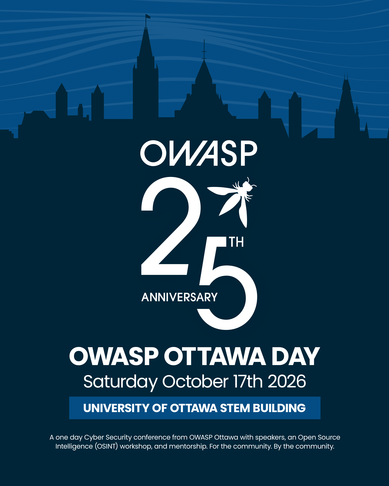

# OWASP Ottawa Day 2026



**Presentations, Workshops, and Mentorship**

| | |
|---|---|
| **Date** | Saturday, October 17, 2026 |
| **Doors / On-site Registration** | 8:00 AM |
| **Program Start** | 8:45 AM |
| **Location** | University of Ottawa — 150 Louis-Pasteur Private · STEM Complex, Ottawa, Ontario |
| **Cost** | Free |
| **Registration** | Required for the speaker track and the OSINT workshop |

A full day of application security learning hosted by the OWASP Ottawa chapter. The day is built
around three parts: a **speaker track**, a hands-on **OSINT workshop**, and a **mentoring** section.

> **Important:** The event is **free**, but **registration is required for the speaker track
> or the OSINT workshop**. Each uses a **separate ticket** You can only register for one, so book only the one you plan to attend. Workshop seating is limited.

---

## Registration

Attendance is **free**, but **registration is required for the speaker track and for the OSINT
workshop**. The two are ticketed separately — one ticket does not cover the other, so register for
only the session you plan to attend. 

**Speakers Track Ticketing: [https://www.tickettailor.com/events/owaspottawachapter/2389944](https://www.tickettailor.com/events/owaspottawachapter/2389944)**

**OSINT Workshop Ticketing: [https://app.tickettailor.com/events/owaspottawachapter/2389995](https://app.tickettailor.com/events/owaspottawachapter/2389995)**


| What | Cost | Registration | Link |
|---|---|---|---|
| Speaker Track | Free | Required — its own ticket | **[Speakers Track Ticketing](https://www.tickettailor.com/events/owaspottawachapter/2389944)** |
| OSINT Workshop | Free | Required — a separate ticket | **[OSINT Workshop Ticketing](https://app.tickettailor.com/events/owaspottawachapter/2389995)** |
| Mentoring | Free | No separate ticket | — |

---

## Speaker Track

A day of talks from practitioners on application security, secure development, threat modelling,
and the current state of the OWASP projects.

- **Cost:** free — registration required
- **Registration:** a separate ticket from the OSINT workshop
- **Room:** STM 117
- **Start:** 8:45 AM, following the 9:00 AM keynote

**Speakers Track Ticketing: [https://www.tickettailor.com/events/owaspottawachapter/2389944](https://www.tickettailor.com/events/owaspottawachapter/2389944)**

## OSINT Workshop

A hands-on, instructor-led workshop on Open Source Intelligence techniques. Attendees work through
practical exercises rather than sitting through slides.

- **Cost:** free — registration required
- **Registration:** a **separate ticket** from the speaker track
- **Room:** STM 564
- **Start:** 9:30 AM
- **Seating:** limited; register early
- **Bring:** a laptop (setup details and any pre-requisites will be posted before the event)

**OSINT Workshop Ticketing: [https://app.tickettailor.com/events/owaspottawachapter/2389995](https://app.tickettailor.com/events/owaspottawachapter/2389995)**

## Mentoring

Mentoring sessions connect attendees with experienced security practitioners for career guidance,
resume and portfolio feedback, and advice on breaking into or growing within application security.

```
Are you an experienced Security Professional in Ottawa and wish to share your wisdom with students
and the community?
```
[Mentor signup form](https://forms.cloud.microsoft/r/GaJ56qGZxA)

- Those seeking a session with mentor is open to students, career changers, and early-career practitioners
- **Room:** STM 464


## Volunteering

We are looking for volunteers to help with all aspects of making this a successful and educational event for the community.
If you wish to give back to your community we would love your help. 
[Volunteer Sign Up Form](https://forms.gle/JqiA1Ak6fPrXNsHq6)

---

## General Day Schedule

Doors open and on-site registration begins at **8:00 AM**, with
the program starting at **8:45 AM**.

| Time | Session |
|---|---|
| 8:00 AM | Doors open — on-site registration and check-in |
| 8:45 AM | Welcome and opening remarks — STEM 117|
| 9:00 AM | Speaker track sessions begin — STM 117 |
| 9:00 AM | OSINT workshop begins — STM 564 |
| 9:00 AM | Mentoring sessions — STM 464 |
| 12:00 PM | Lunch |
| 1:00 PM | Sessions Continue |
| 5:00 PM | Closing remarks — STM 117 |
| 6:00 PM | The AfterParty — Nelson Pub |

---

## Speaker Schedule

| Time | Speaker | Talk / Topic |
| --- | --- | --- |
| **8:45–9:00 AM** | **Garth Boyd** | *Welcome* |
| **9:00–9:55** | **Farshad Abasi** | *Your Threat Model Is Lying to You: Why Modeling the Design Isn't Enough in 2026* |
| **10:00–10:25** | **Sabrina Lavi** | *People-Powered Security: Scaling AppSec Through Champions, Community, and Culture* |
| **10:30–11:25** | **Alexander Rudolph** | *Canadian Digital Sovereignty in a Zero-Trust World: Unpacking Socio-Economic Dimensions of Digital Sovereignty* |
| **11:30–11:55** | **Kayode Olabisi** | *Your LLM App Passed the Checklist. Now What?* |
| **12:00–1:00** | — | **Lunch** |
| **1:00–1:55** | **Ben Gardiner** | *Tractor ECU RE: When a "Noise Triggered" Recall is also a Security Patch* |
| **2:00–2:25** | **Magno Logan** | *Nobody's Mining Crypto Anymore: What Attackers Actually Want From Your CI* |
| **2:30–2:55** | **Kishan Nagendra** | *Agentic AI Design Patterns and Their Security Implications* |
| **3:00–3:55** | **Faustin Bouchard** | *Stop Policing Words. Govern Authorization.* |
| **4:00–4:25** | **Pavel Shukhman** | *Who Wrote This Code? A Forensic Whodunit in the Agentic Era* |
| **4:30–4:55** | **Logan MacLaren/Fennix** | *50 Shades of Red - Red Teaming & Pentesting in Practice* |
| **5:00–5:10** | **Garth Boyd** | *Closing* |

---

## Venue

**University of Ottawa — STEM Complex**
Ottawa, Ontario, Canada

Rooms:

- **Speaker Track** — STM 117
- **Closing Remarks** — STM 117
- **OSINT Workshop** — STM 564
- **Mentoring** — STM 464

Parking and transit details: TBA.

---

## Hosted and Supported By

- OWASP Ottawa Chapter and the OWASP Foundation
- uOttawa–IBM Cyber Range
- University of Ottawa, Faculty of Engineering
- Other sponsors TBA

---

## Stay Informed

Registration links, the speaker list, and the final schedule will be posted to this repository and
announced through the OWASP Ottawa chapter channels. Watch this repository for updates.

For questions about the event, sponsorship, or speaking, contact the OWASP Ottawa chapter organizers.

* [Mastodon](https://infosec.exchange/@OWASP_Ottawa)
* [Bluesky](https://bsky.app/profile/owaspottawa.bsky.social)
* [LinkedIN](https://www.linkedin.com/company/owasp-ottawa)


